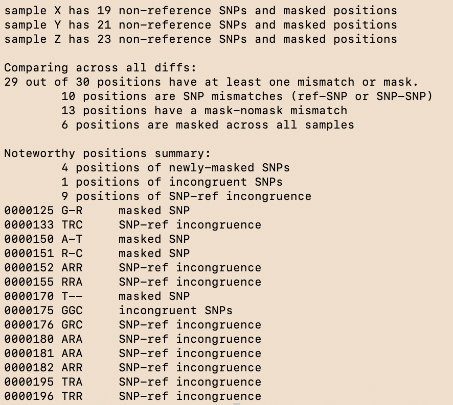
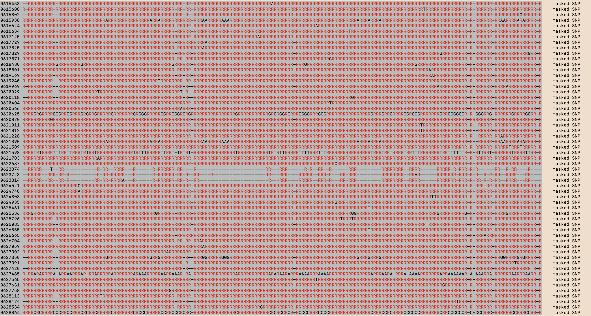

# diffdiff
 Highlight the differences between MAPLE-formatted genomic diff files by aligning them by position. Can display just SNP-ref, SNP-SNP, and SNP-mask differences, or show literally *every* difference. Output full alignment, noteworthy-only alignment, `matUtils mask`-ready input, and summary information to a file. Use ANSI highlighting -- or not -- to make differences really stand out in the terminal.
 
 Use cases:
 * You have some (ideally <10 but >100 is supported) highly-clonal sequences and want to look at every difference between them
 * You want to validate phylogenetic analysis/distance matrices between samples
 * You want to run matUtils mask
 * You want to backmask (see -h) some diff files, are aware of the limitations, and cannot/do not wish to use Tree Nine's method of backmasking
 
 ## What are MAPLE diff files?
 Essentially VCFs but with much less detail, see ./tests/ for examples. Everything is represented as either a SNP or an explict mask (`-`). First column is allele, second is position, third is how long the allele is. Example: `A 123 2` means that at positions 123 and 124, non-reference SNP `A` is called.

 You can generate MAPLE diff files from VCFs using [this WDL](https://github.com/aofarrel/vcf_to_diff_wdl) or [this pure Python script](https://github.com/lilymaryam/parsevcf). If you're starting with FASTQs or BioSample accessions, consider [the myco WDL pipeline](https://github.com/aofarrel/myco/) which outputs MAPLE diff files at the end.

 ## Usage
 1. Get this repo, or at least diffdiff.py, into your workdir (`git clone` or whatever)
 2. `pip install tqdm` (for progress bars)
 3. If you have one concatenated diff file instead of one per sample, run `/bin/bash split_concatenated_diff.sh` to split it first.
 4. Generate a newline-delimited file listing paths to your diffs (see ./tests/paths.txt for example)
 5. `python3 diffdiff.py [paths_file]`

 For all arguments please run `python3 diffdiff.py -h`

## Benchmarking
 For its intended use case (less than ten diff files), diffdiff will run basically instantly. If you're using more than that, you probably should be using phylogenetics software instead, but diffdiff will still work. Time to run is influenced by number of diff files and number of positions total. File outputs (`-ao`, `-so`, `-no`) are negliable factors on runtime, except when backmasking (see -h for more on backmasking).

 For fun, 188 diff files derived from NCBI SRA data were input, totalling 4,236,876 mentioned sites. On a 2019 x86 Macbook Pro, the alignment finished in 6 minutes and 34 seconds.

## Examples
Alignments and summary information can be written to files via `-ao` and `-so` respectively. Below are representations of stdout in my terminal. Try `-a` instead of `-c` (or use neither) if you prefer dark-colored terminals.

### Provided test files, default

### 188 diffs, `-c`:
This is a good example of why this works best with highly clonal samples; one sample with a lot of masking will hide most ref-SNP differences.
 

